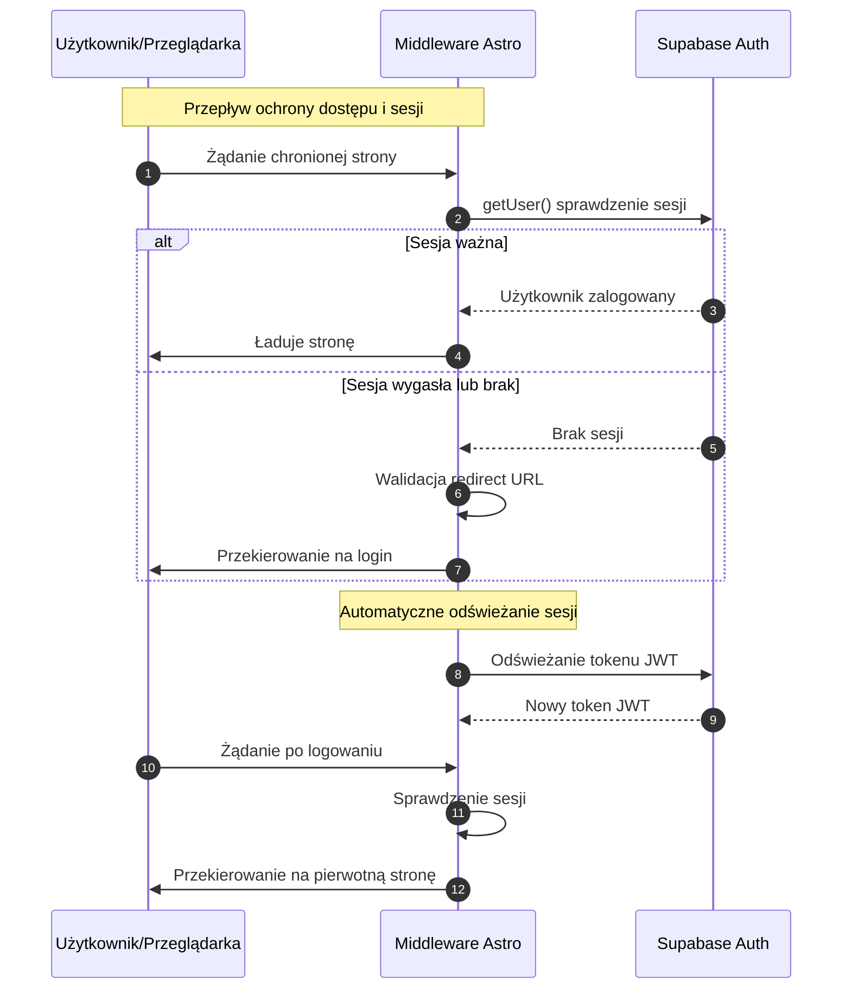

# Diagram Architektury Autentykacji - Ochrona dostępu i zarządzanie sesją

```mermaid
sequenceDiagram
    autonumber

    participant U as Użytkownik/Przeglądarka
    participant M as Middleware Astro
    participant S as Supabase Auth

    Note over U,M: Przepływ ochrony dostępu i sesji
    U->>M: Żądanie chronionej strony
    M->>S: getUser() sprawdzenie sesji
    alt Sesja ważna
        S-->>M: Użytkownik zalogowany
        M->>U: Ładuje stronę
    else Sesja wygasła lub brak
        S-->>M: Brak sesji
        M->>M: Walidacja redirect URL
        M->>U: Przekierowanie na login
    end

    Note over M: Automatyczne odświeżanie sesji
    M->>S: Odświeżanie tokenu JWT
    S-->>M: Nowy token JWT

    U->>M: Żądanie po logowaniu
    M->>M: Sprawdzenie sesji
    M->>U: Przekierowanie na pierwotną stronę
```
