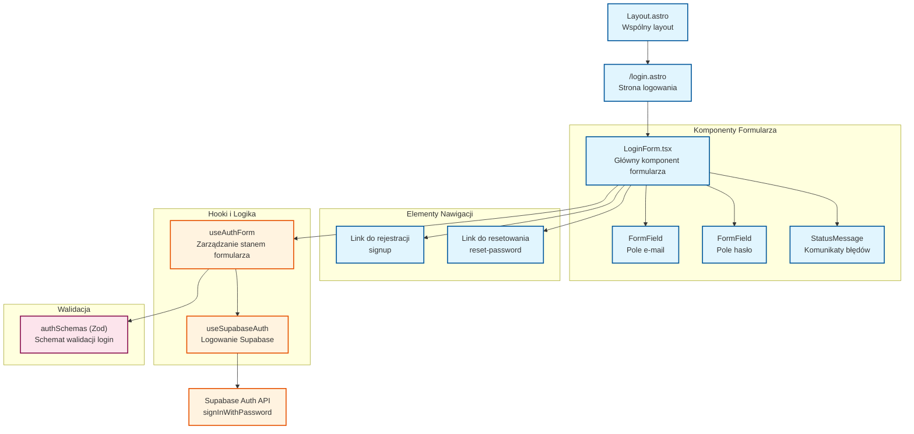
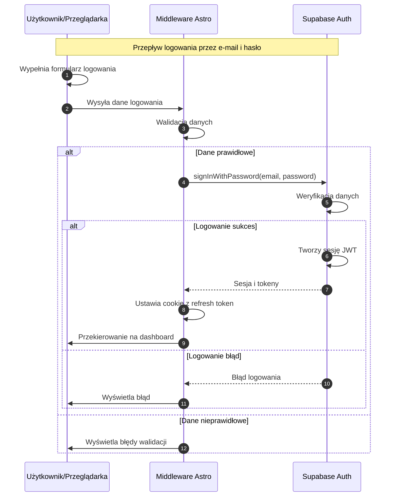

# Architektura UI - Logowanie przez e-mail i hasło

## Diagram Komponentów UI

```mermaid
flowchart TD
    A["Layout.astro<br/>Wspólny layout"] --> B["/login.astro<br/>Strona logowania"]

    subgraph "Komponenty Formularza"
        C1["LoginForm.tsx<br/>Główny komponent formularza"]
        C2["FormField<br/>Pole e-mail"]
        C3["FormField<br/>Pole hasło"]
        C4["StatusMessage<br/>Komunikaty błędów"]
    end

    subgraph "Elementy Nawigacji"
        D1["Link do rejestracji<br/>signup"]
        D2["Link do resetowania<br/>reset-password"]
    end

    subgraph "Hooki i Logika"
        E1["useAuthForm<br/>Zarządzanie stanem formularza"]
        E2["useSupabaseAuth<br/>Logowanie Supabase"]
    end

    subgraph "Walidacja"
        F1["authSchemas (Zod)<br/>Schemat walidacji login"]
    end

    B --> C1
    C1 --> C2
    C1 --> C3
    C1 --> C4
    C1 --> D1
    C1 --> D2

    C1 --> E1
    E1 --> E2
    E1 --> F1

    E2 --> G["Supabase Auth API<br/>signInWithPassword"]

    classDef ui fill:#e1f5fe,stroke:#01579b,stroke-width:2px
    classDef logic fill:#fff3e0,stroke:#e65100,stroke-width:2px
    classDef validation fill:#fce4ec,stroke:#880e4f,stroke-width:2px

    class A,B,C1,C2,C3,C4,D1,D2 ui
    class E1,E2,G logic
    class F1 validation
```

## Diagram Przepływu Logowania

```mermaid
sequenceDiagram
    autonumber

    participant U as Użytkownik/Przeglądarka
    participant M as Middleware Astro
    participant S as Supabase Auth

    Note over U,S: Przepływ logowania przez e-mail i hasło
    U->>U: Wypełnia formularz logowania
    U->>M: Wysyła dane logowania
    M->>M: Walidacja danych
    alt Dane prawidłowe
        M->>S: signInWithPassword(email, password)
        S->>S: Weryfikacja danych
        alt Logowanie sukces
            S->>S: Tworzy sesję JWT
            S-->>M: Sesja i tokeny
            M->>M: Ustawia cookie z refresh token
            M->>U: Przekierowanie na dashboard
        else Logowanie błąd
            S-->>M: Błąd logowania
            M->>U: Wyświetla błąd
        end
    else Dane nieprawidłowe
        M->>U: Wyświetla błędy walidacji
    end
```
