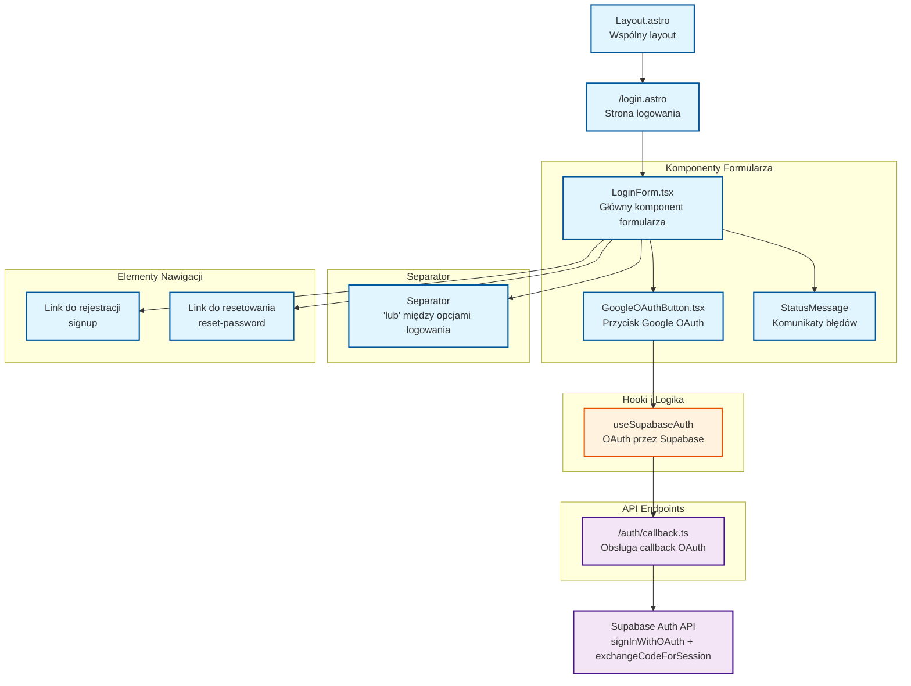
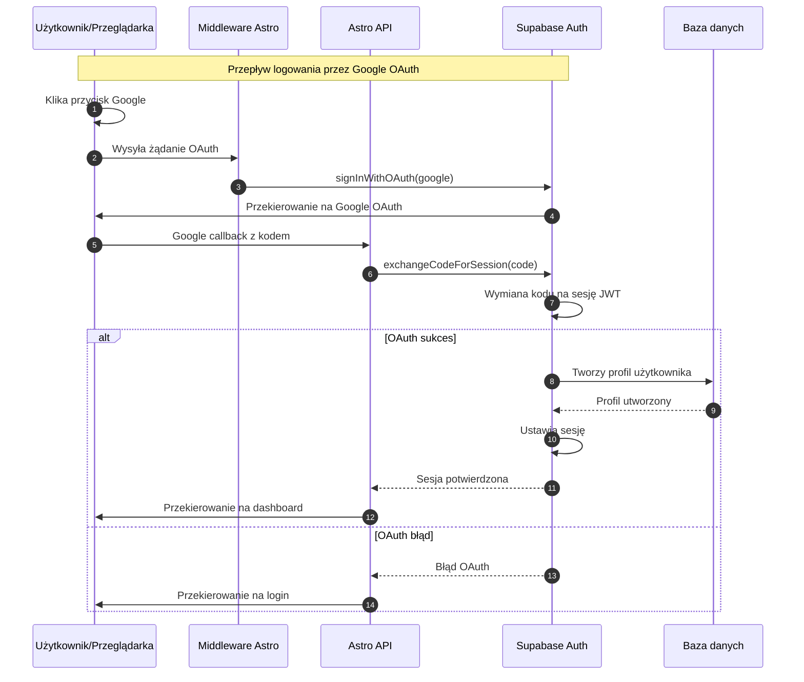

# Architektura UI - Logowanie przez Google OAuth

## Diagram Komponentów UI

```mermaid
flowchart TD
    A["Layout.astro<br/>Wspólny layout"] --> B["/login.astro<br/>Strona logowania"]

    subgraph "Komponenty Formularza"
        C1["LoginForm.tsx<br/>Główny komponent formularza"]
        C2["GoogleOAuthButton.tsx<br/>Przycisk Google OAuth"]
        C3["StatusMessage<br/>Komunikaty błędów"]
    end

    subgraph "Separator"
        D1["Separator<br/>'lub' między opcjami logowania"]
    end

    subgraph "Elementy Nawigacji"
        E1["Link do rejestracji<br/>signup"]
        E2["Link do resetowania<br/>reset-password"]
    end

    subgraph "Hooki i Logika"
        F1["useSupabaseAuth<br/>OAuth przez Supabase"]
    end

    subgraph "API Endpoints"
        G1["/auth/callback.ts<br/>Obsługa callback OAuth"]
    end

    B --> C1
    C1 --> C2
    C1 --> C3
    C1 --> D1
    C1 --> E1
    C1 --> E2

    C2 --> F1
    F1 --> G1
    G1 --> H["Supabase Auth API<br/>signInWithOAuth + exchangeCodeForSession"]

    classDef ui fill:#e1f5fe,stroke:#01579b,stroke-width:2px
    classDef logic fill:#fff3e0,stroke:#e65100,stroke-width:2px
    classDef api fill:#f3e5f5,stroke:#4a148c,stroke-width:2px

    class A,B,C1,C2,C3,D1,E1,E2 ui
    class F1 logic
    class G1,H api
```

## Diagram Przepływu Google OAuth

```mermaid
sequenceDiagram
    autonumber

    participant U as Użytkownik/Przeglądarka
    participant M as Middleware Astro
    participant A as Astro API
    participant S as Supabase Auth
    participant D as Baza danych

    Note over U,S: Przepływ logowania przez Google OAuth
    U->>U: Klika przycisk Google
    U->>M: Wysyła żądanie OAuth
    M->>S: signInWithOAuth(google)
    S->>U: Przekierowanie na Google OAuth

    U->>A: Google callback z kodem
    A->>S: exchangeCodeForSession(code)
    S->>S: Wymiana kodu na sesję JWT
    alt OAuth sukces
        S->>D: Tworzy profil użytkownika
        D-->>S: Profil utworzony
        S->>S: Ustawia sesję
        S-->>A: Sesja potwierdzona
        A->>U: Przekierowanie na dashboard
    else OAuth błąd
        S-->>A: Błąd OAuth
        A->>U: Przekierowanie na login
    end
```
