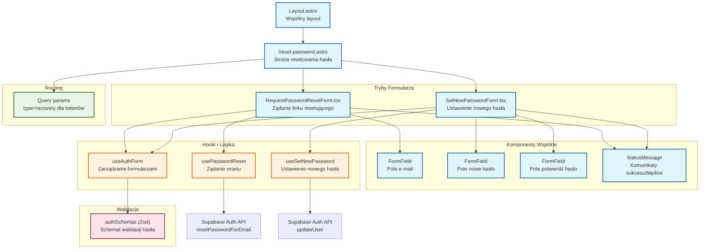
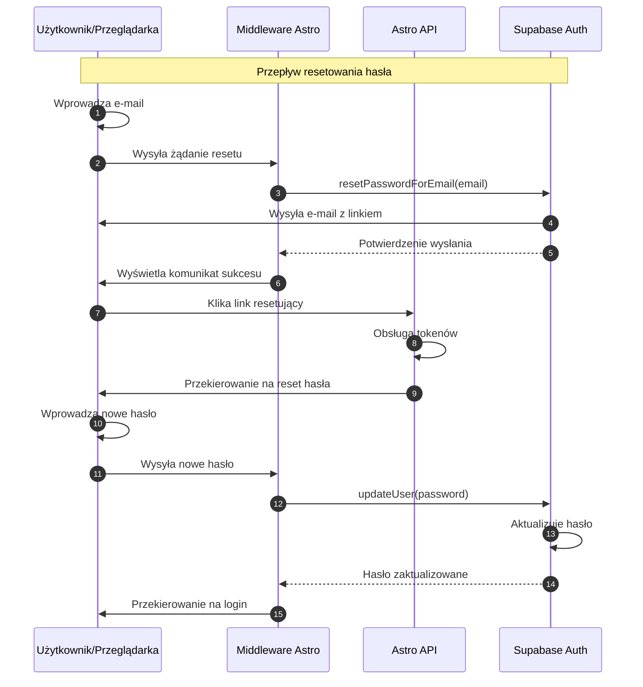

# Architektura UI - Resetowanie hasła

## Diagram Komponentów UI

```mermaid
flowchart TD
    A["Layout.astro<br/>Wspólny layout"] --> B["/reset-password.astro<br/>Strona resetowania hasła"]

    subgraph "Tryby Formularza"
        C1["RequestPasswordResetForm.tsx<br/>Żądanie linku resetującego"]
        C2["SetNewPasswordForm.tsx<br/>Ustawienie nowego hasła"]
    end

    subgraph "Komponenty Wspólne"
        D1["FormField<br/>Pole e-mail"]
        D2["FormField<br/>Pole nowe hasło"]
        D3["FormField<br/>Pole potwierdź hasło"]
        D4["StatusMessage<br/>Komunikaty sukcesu/błędów"]
    end

    subgraph "Hooki i Logika"
        E1["usePasswordReset<br/>Żądanie resetu"]
        E2["useSetNewPassword<br/>Ustawienie nowego hasła"]
        E3["useAuthForm<br/>Zarządzanie formularzami"]
    end

    subgraph "Walidacja"
        F1["authSchemas (Zod)<br/>Schemat walidacji hasła"]
    end

    subgraph "Routing"
        G1["Query params<br/>type=recovery dla tokenów"]
    end

    B --> C1
    B --> C2
    B --> G1

    C1 --> D1
    C1 --> D4
    C2 --> D2
    C2 --> D3
    C2 --> D4

    C1 --> E1
    C2 --> E2
    C1 --> E3
    C2 --> E3

    E3 --> F1

    E1 --> H["Supabase Auth API<br/>resetPasswordForEmail"]
    E2 --> I["Supabase Auth API<br/>updateUser"]

    classDef ui fill:#e1f5fe,stroke:#01579b,stroke-width:2px
    classDef logic fill:#fff3e0,stroke:#e65100,stroke-width:2px
    classDef validation fill:#fce4ec,stroke:#880e4f,stroke-width:2px
    classDef routing fill:#e8f5e8,stroke:#1b5e20,stroke-width:2px

    class A,B,C1,C2,D1,D2,D3,D4 ui
    class E1,E2,E3 logic
    class F1 validation
    class G1 routing
```

## Diagram Przepływu Resetowania Hasła

```mermaid
sequenceDiagram
    autonumber

    participant U as Użytkownik/Przeglądarka
    participant M as Middleware Astro
    participant A as Astro API
    participant S as Supabase Auth

    Note over U,S: Przepływ resetowania hasła
    U->>U: Wprowadza e-mail
    U->>M: Wysyła żądanie resetu
    M->>S: resetPasswordForEmail(email)
    S->>U: Wysyła e-mail z linkiem
    S-->>M: Potwierdzenie wysłania
    M->>U: Wyświetla komunikat sukcesu

    U->>A: Klika link resetujący
    A->>A: Obsługa tokenów
    A->>U: Przekierowanie na reset hasła

    U->>U: Wprowadza nowe hasło
    U->>M: Wysyła nowe hasło
    M->>S: updateUser(password)
    S->>S: Aktualizuje hasło
    S-->>M: Hasło zaktualizowane
    M->>U: Przekierowanie na login
```
