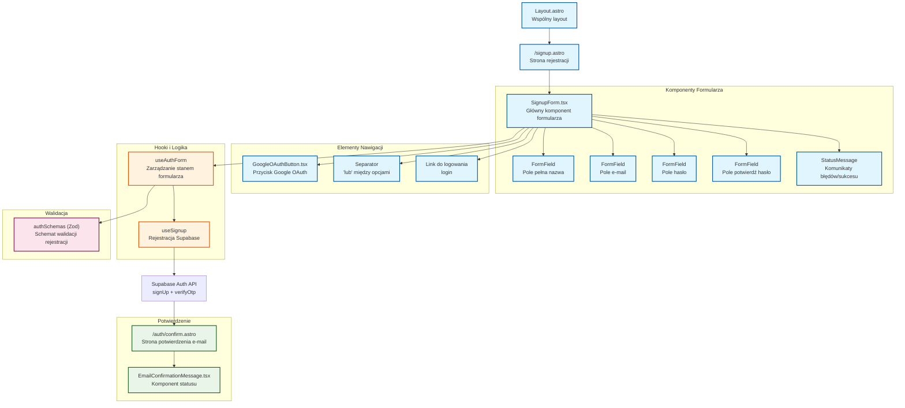
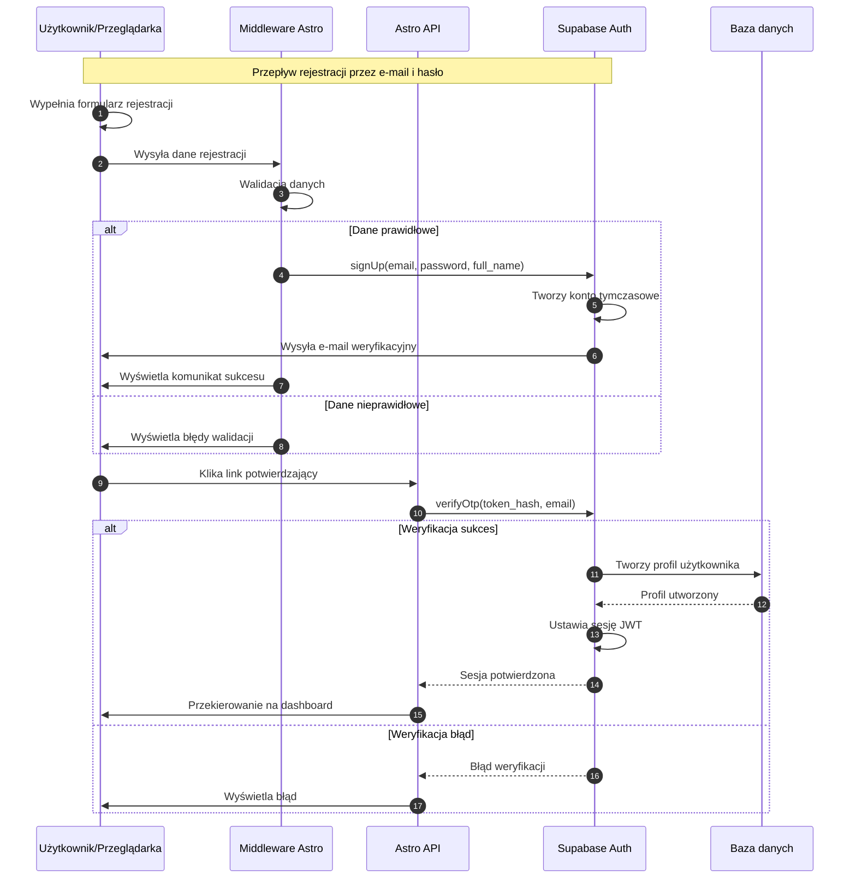

# Architektura UI - Rejestracja nowego konta

## Diagram Komponentów UI

```mermaid
flowchart TD
    A["Layout.astro<br/>Wspólny layout"] --> B["/signup.astro<br/>Strona rejestracji"]

    subgraph "Komponenty Formularza"
        C1["SignupForm.tsx<br/>Główny komponent formularza"]
        C2["FormField<br/>Pole pełna nazwa"]
        C3["FormField<br/>Pole e-mail"]
        C4["FormField<br/>Pole hasło"]
        C5["FormField<br/>Pole potwierdź hasło"]
        C6["StatusMessage<br/>Komunikaty błędów/sukcesu"]
    end

    subgraph "Elementy Nawigacji"
        D1["GoogleOAuthButton.tsx<br/>Przycisk Google OAuth"]
        D2["Separator<br/>'lub' między opcjami"]
        D3["Link do logowania<br/>login"]
    end

    subgraph "Hooki i Logika"
        E1["useAuthForm<br/>Zarządzanie stanem formularza"]
        E2["useSignup<br/>Rejestracja Supabase"]
    end

    subgraph "Walidacja"
        F1["authSchemas (Zod)<br/>Schemat walidacji rejestracji"]
    end

    subgraph "Potwierdzenie"
        G1["/auth/confirm.astro<br/>Strona potwierdzenia e-mail"]
        G2["EmailConfirmationMessage.tsx<br/>Komponent statusu"]
    end

    B --> C1
    C1 --> C2
    C1 --> C3
    C1 --> C4
    C1 --> C5
    C1 --> C6
    C1 --> D1
    C1 --> D2
    C1 --> D3

    C1 --> E1
    E1 --> E2
    E1 --> F1

    E2 --> H["Supabase Auth API<br/>signUp + verifyOtp"]

    H --> G1
    G1 --> G2

    classDef ui fill:#e1f5fe,stroke:#01579b,stroke-width:2px
    classDef logic fill:#fff3e0,stroke:#e65100,stroke-width:2px
    classDef validation fill:#fce4ec,stroke:#880e4f,stroke-width:2px
    classDef confirm fill:#e8f5e8,stroke:#1b5e20,stroke-width:2px

    class A,B,C1,C2,C3,C4,C5,C6,D1,D2,D3 ui
    class E1,E2 logic
    class F1 validation
    class G1,G2 confirm
```

## Diagram Przepływu Rejestracji

```mermaid
sequenceDiagram
    autonumber

    participant U as Użytkownik/Przeglądarka
    participant M as Middleware Astro
    participant A as Astro API
    participant S as Supabase Auth
    participant D as Baza danych

    Note over U,S: Przepływ rejestracji przez e-mail i hasło
    U->>U: Wypełnia formularz rejestracji
    U->>M: Wysyła dane rejestracji
    M->>M: Walidacja danych
    alt Dane prawidłowe
        M->>S: signUp(email, password, full_name)
        S->>S: Tworzy konto tymczasowe
        S->>U: Wysyła e-mail weryfikacyjny
        M->>U: Wyświetla komunikat sukcesu
    else Dane nieprawidłowe
        M->>U: Wyświetla błędy walidacji
    end

    U->>A: Klika link potwierdzający
    A->>S: verifyOtp(token_hash, email)
    alt Weryfikacja sukces
        S->>D: Tworzy profil użytkownika
        D-->>S: Profil utworzony
        S->>S: Ustawia sesję JWT
        S-->>A: Sesja potwierdzona
        A->>U: Przekierowanie na dashboard
    else Weryfikacja błąd
        S-->>A: Błąd weryfikacji
        A->>U: Wyświetla błąd
    end
```
