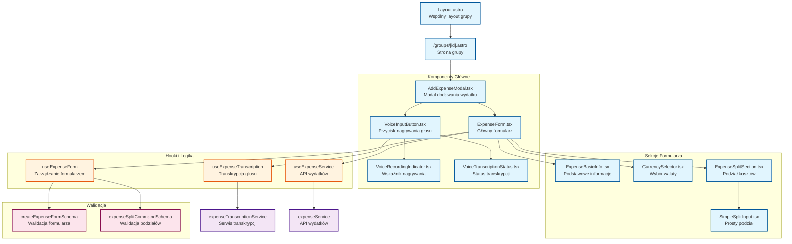
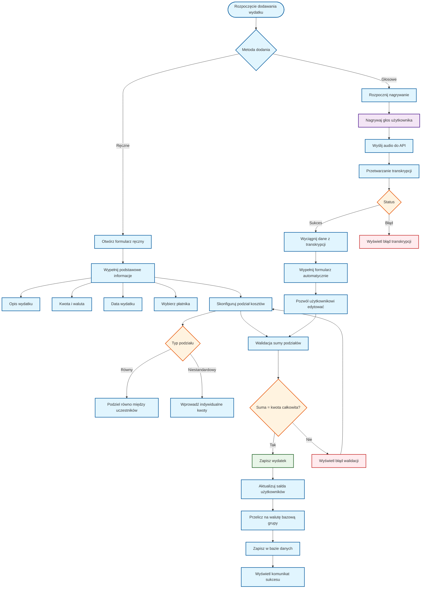
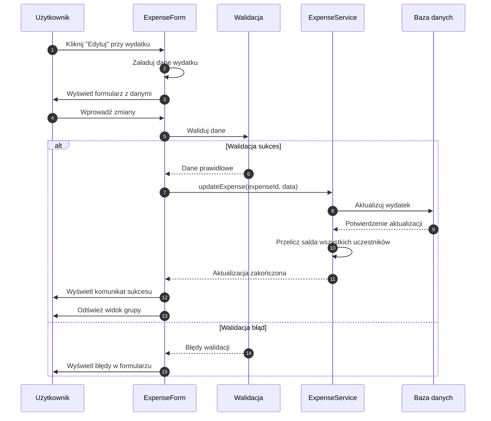

# Architektura Zarządzania Wydatkami

## Diagram Komponentów UI

```mermaid
flowchart TD
    A["Layout.astro<br/>Wspólny layout grupy"] --> B["/groups/[id].astro<br/>Strona grupy"]

    subgraph "Komponenty Główne"
        C1["AddExpenseModal.tsx<br/>Modal dodawania wydatku"]
        C2["ExpenseForm.tsx<br/>Główny formularz"]
        C3["VoiceInputButton.tsx<br/>Przycisk nagrywania głosu"]
        C4["VoiceRecordingIndicator.tsx<br/>Wskaźnik nagrywania"]
        C5["VoiceTranscriptionStatus.tsx<br/>Status transkrypcji"]
    end

    subgraph "Sekcje Formularza"
        D1["ExpenseBasicInfo.tsx<br/>Podstawowe informacje"]
        D2["CurrencySelector.tsx<br/>Wybór waluty"]
        D3["ExpenseSplitSection.tsx<br/>Podział kosztów"]
        D4["SimpleSplitInput.tsx<br/>Prosty podział"]
    end

    subgraph "Hooki i Logika"
        E1["useExpenseForm<br/>Zarządzanie formularzem"]
        E2["useExpenseTranscription<br/>Transkrypcja głosu"]
        E3["useExpenseService<br/>API wydatków"]
    end

    subgraph "Walidacja"
        F1["createExpenseFormSchema<br/>Walidacja formularza"]
        F2["expenseSplitCommandSchema<br/>Walidacja podziałów"]
    end

    B --> C1
    C1 --> C2
    C2 --> D1
    C2 --> D2
    C2 --> D3
    D3 --> D4

    C1 --> C3
    C3 --> C4
    C3 --> C5

    C2 --> E1
    C3 --> E2
    C2 --> E3

    E1 --> F1
    E1 --> F2

    E2 --> G["expenseTranscriptionService<br/>Serwis transkrypcji"]
    E3 --> H["expenseService<br/>API wydatków"]

    classDef ui fill:#e1f5fe,stroke:#01579b,stroke-width:2px
    classDef logic fill:#fff3e0,stroke:#e65100,stroke-width:2px
    classDef validation fill:#fce4ec,stroke:#880e4f,stroke-width:2px
    classDef api fill:#f3e5f5,stroke:#4a148c,stroke-width:2px

    class A,B,C1,C2,C3,C4,C5,D1,D2,D3,D4 ui
    class E1,E2,E3 logic
    class F1,F2 validation
    class G,H api
```

## Diagram Przepływu Dodawania Wydatku

```mermaid
flowchart TD
    START(["Rozpoczęcie dodawania wydatku"])

    START --> A{"Metoda dodania"}
    A -->|"Ręczne"| B["Otwórz formularz ręczny"]
    A -->|"Głosowe"| C["Rozpocznij nagrywanie"]

    B --> D["Wypełnij podstawowe informacje"]
    D --> D1["Opis wydatku"]
    D --> D2["Kwota i waluta"]
    D --> D3["Data wydatku"]
    D --> D4["Wybierz płatnika"]

    D --> E["Skonfiguruj podział kosztów"]
    E --> E1{"Typ podziału"}
    E1 -->|"Równy"| E2["Podziel równo między uczestników"]
    E1 -->|"Niestandardowy"| E3["Wprowadź indywidualne kwoty"]

    E --> F["Walidacja sumy podziałów"]
    F --> F1{"Suma = kwota całkowita?"}
    F1 -->|"Tak"| G["Zapisz wydatek"]
    F1 -->|"Nie"| F2["Wyświetl błąd walidacji"]
    F2 --> E

    C --> H["Nagrywaj głos użytkownika"]
    H --> I["Wyślij audio do API"]
    I --> J["Przetwarzanie transkrypcji"]
    J --> K{"Status"}
    K -->|"Sukces"| L["Wyciągnij dane z transkrypcji"]
    K -->|"Błąd"| M["Wyświetl błąd transkrypcji"]

    L --> N["Wypełnij formularz automatycznie"]
    N --> O["Pozwól użytkownikowi edytować"]
    O --> F

    G --> P["Aktualizuj salda użytkowników"]
    P --> Q["Przelicz na walutę bazową grupy"]
    Q --> R["Zapisz w bazie danych"]
    R --> S["Wyświetl komunikat sukcesu"]

    classDef process fill:#e1f5fe,stroke:#01579b,stroke-width:2px
    classDef decision fill:#fff3e0,stroke:#e65100,stroke-width:2px
    classDef action fill:#f3e5f5,stroke:#4a148c,stroke-width:2px
    classDef success fill:#e8f5e8,stroke:#1b5e20,stroke-width:2px
    classDef error fill:#ffebee,stroke:#c62828,stroke-width:2px

    class START,A,B,C,D,D1,D2,D3,D4,E,E2,E3,F,I,J,L,N,O,P,Q,R,S process
    class E1,F1,K decision
    class H action
    class G success
    class F2,M error
```

## Diagram Edycji Wydatku

```mermaid
sequenceDiagram
    autonumber

    participant U as Użytkownik
    participant F as ExpenseForm
    participant V as Walidacja
    participant S as ExpenseService
    participant DB as Baza danych

    U->>F: Kliknij "Edytuj" przy wydatku
    F->>F: Załaduj dane wydatku
    F->>U: Wyświetl formularz z danymi

    U->>F: Wprowadź zmiany
    F->>V: Waliduj dane
    alt Walidacja sukces
        V-->>F: Dane prawidłowe
        F->>S: updateExpense(expenseId, data)
        S->>DB: Aktualizuj wydatek
        DB-->>S: Potwierdzenie aktualizacji
        S->>S: Przelicz salda wszystkich uczestników
        S-->>F: Aktualizacja zakończona
        F->>U: Wyświetl komunikat sukcesu
        F->>U: Odśwież widok grupy
    else Walidacja błąd
        V-->>F: Błędy walidacji
        F->>U: Wyświetl błędy w formularzu
    end
```
