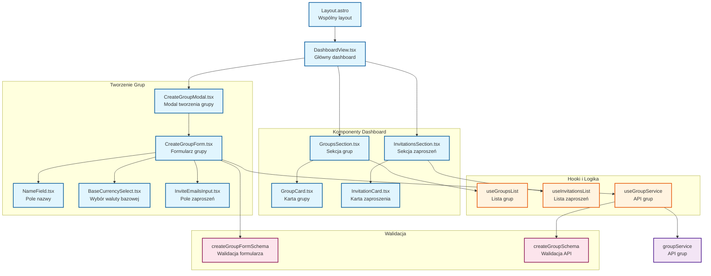
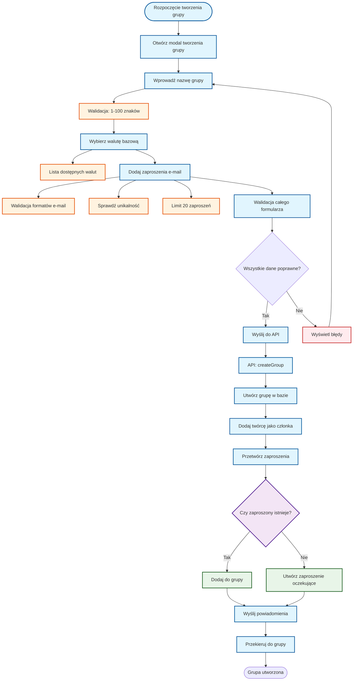
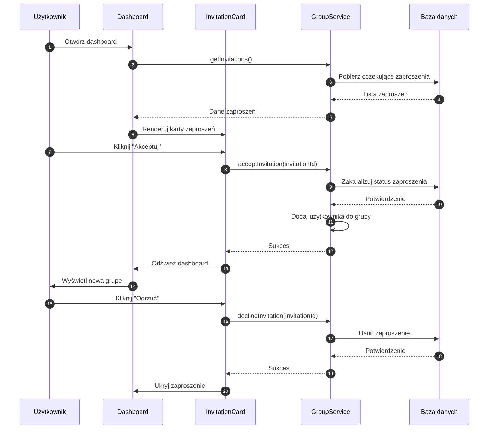

# Architektura Zarządzania Grupami

## Diagram Komponentów UI

```mermaid
flowchart TD
    A["Layout.astro<br/>Wspólny layout"] --> B["DashboardView.tsx<br/>Główny dashboard"]

    subgraph "Komponenty Dashboard"
        C1["GroupsSection.tsx<br/>Sekcja grup"]
        C2["GroupCard.tsx<br/>Karta grupy"]
        C3["InvitationsSection.tsx<br/>Sekcja zaproszeń"]
        C4["InvitationCard.tsx<br/>Karta zaproszenia"]
    end

    subgraph "Tworzenie Grup"
        D1["CreateGroupModal.tsx<br/>Modal tworzenia grupy"]
        D2["CreateGroupForm.tsx<br/>Formularz grupy"]
        D3["NameField.tsx<br/>Pole nazwy"]
        D4["BaseCurrencySelect.tsx<br/>Wybór waluty bazowej"]
        D5["InviteEmailsInput.tsx<br/>Pole zaproszeń"]
    end

    subgraph "Hooki i Logika"
        E1["useGroupsList<br/>Lista grup"]
        E2["useInvitationsList<br/>Lista zaproszeń"]
        E3["useGroupService<br/>API grup"]
    end

    subgraph "Walidacja"
        F1["createGroupFormSchema<br/>Walidacja formularza"]
        F2["createGroupSchema<br/>Walidacja API"]
    end

    B --> C1
    B --> C3

    C1 --> C2
    C3 --> C4

    B --> D1
    D1 --> D2
    D2 --> D3
    D2 --> D4
    D2 --> D5

    C1 --> E1
    C3 --> E2
    D2 --> E3

    D2 --> F1
    E3 --> F2

    E3 --> G["groupService<br/>API grup"]

    classDef ui fill:#e1f5fe,stroke:#01579b,stroke-width:2px
    classDef logic fill:#fff3e0,stroke:#e65100,stroke-width:2px
    classDef validation fill:#fce4ec,stroke:#880e4f,stroke-width:2px
    classDef api fill:#f3e5f5,stroke:#4a148c,stroke-width:2px

    class A,B,C1,C2,C3,C4,D1,D2,D3,D4,D5 ui
    class E1,E2,E3 logic
    class F1,F2 validation
    class G api
```

## Diagram Przepływu Tworzenia Grupy

```mermaid
flowchart TD
    START(["Rozpoczęcie tworzenia grupy"])

    START --> A["Otwórz modal tworzenia grupy"]
    A --> B["Wprowadź nazwę grupy"]
    B --> B1["Walidacja: 1-100 znaków"]
    B1 --> C["Wybierz walutę bazową"]
    C --> C1["Lista dostępnych walut"]

    C --> D["Dodaj zaproszenia e-mail"]
    D --> D1["Walidacja formatów e-mail"]
    D --> D2["Sprawdź unikalność"]
    D --> D3["Limit 20 zaproszeń"]

    D --> E["Walidacja całego formularza"]
    E --> E1{"Wszystkie dane poprawne?"}
    E1 -->|"Tak"| F["Wyślij do API"]
    E1 -->|"Nie"| G["Wyświetl błędy"]
    G --> B

    F --> H["API: createGroup"]
    H --> I["Utwórz grupę w bazie"]
    I --> J["Dodaj twórcę jako członka"]
    J --> K["Przetwórz zaproszenia"]

    K --> L{"Czy zaproszony istnieje?"}
    L -->|"Tak"| M["Dodaj do grupy"]
    L -->|"Nie"| N["Utwórz zaproszenie oczekujące"]

    M --> O["Wyślij powiadomienia"]
    N --> O
    O --> P["Przekieruj do grupy"]
    P --> END(["Grupa utworzona"])

    classDef process fill:#e1f5fe,stroke:#01579b,stroke-width:2px
    classDef validation fill:#fff3e0,stroke:#e65100,stroke-width:2px
    classDef decision fill:#f3e5f5,stroke:#4a148c,stroke-width:2px
    classDef action fill:#e8f5e8,stroke:#1b5e20,stroke-width:2px
    classDef error fill:#ffebee,stroke:#c62828,stroke-width:2px

    class START,A,B,C,D,E,F,H,I,J,K,O,P process
    class B1,C1,D1,D2,D3 validation
    class L decision
    class M,N action
    class G error
```

## Diagram Zarządzania Zaproszeniami

```mermaid
sequenceDiagram
    autonumber

    participant U as Użytkownik
    participant D as Dashboard
    participant I as InvitationCard
    participant S as GroupService
    participant DB as Baza danych

    U->>D: Otwórz dashboard
    D->>S: getInvitations()
    S->>DB: Pobierz oczekujące zaproszenia
    DB-->>S: Lista zaproszeń
    S-->>D: Dane zaproszeń
    D->>I: Renderuj karty zaproszeń

    U->>I: Kliknij "Akceptuj"
    I->>S: acceptInvitation(invitationId)
    S->>DB: Zaktualizuj status zaproszenia
    DB-->>S: Potwierdzenie
    S->>S: Dodaj użytkownika do grupy
    S-->>I: Sukces
    I->>D: Odśwież dashboard
    D->>U: Wyświetl nową grupę

    U->>I: Kliknij "Odrzuć"
    I->>S: declineInvitation(invitationId)
    S->>DB: Usuń zaproszenie
    DB-->>S: Potwierdzenie
    S-->>I: Sukces
    I->>D: Ukryj zaproszenie
```
