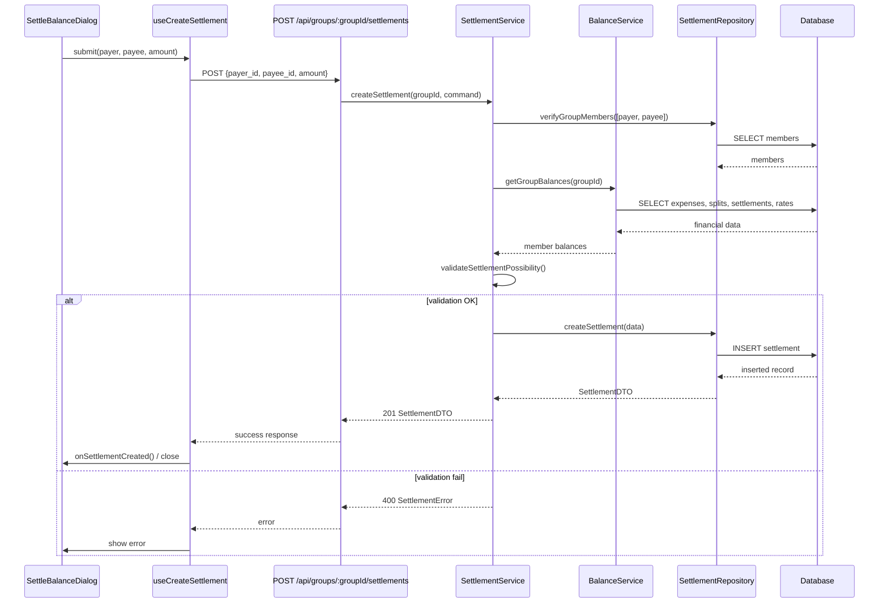

# Przepływ Rozliczeń

## Diagram Sekwencji Rozliczeń

```mermaid
sequenceDiagram

    participant UI as SettleBalanceDialog

    participant Hook as useCreateSettlement

    participant API as POST /api/groups/:groupId/settlements

    participant Service as SettlementService

    participant BalanceSvc as BalanceService

    participant Repo as SettlementRepository

    participant DB as Database

    UI->>Hook: submit(payer, payee, amount)

    Hook->>API: POST {payer_id, payee_id, amount}

    API->>Service: createSettlement(groupId, command)

    Service->>Repo: verifyGroupMembers([payer, payee])

    Repo->>DB: SELECT members

    DB-->>Repo: members

    Service->>BalanceSvc: getGroupBalances(groupId)

    BalanceSvc->>DB: SELECT expenses, splits, settlements, rates

    DB-->>BalanceSvc: financial data

    BalanceSvc-->>Service: member balances

    Service->>Service: validateSettlementPossibility()

    alt validation OK

        Service->>Repo: createSettlement(data)

        Repo->>DB: INSERT settlement

        DB-->>Repo: inserted record

        Repo-->>Service: SettlementDTO

        Service-->>API: 201 SettlementDTO

        API-->>Hook: success response

        Hook->>UI: onSettlementCreated() / close

    else validation fail

        Service-->>API: 400 SettlementError

        API-->>Hook: error

        Hook->>UI: show error

    end
```