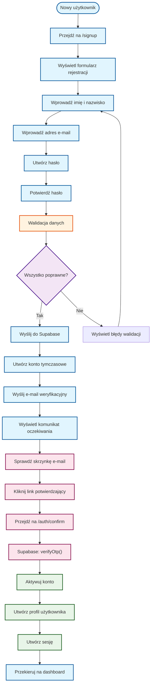

# Przepływ Użytkownika przez Aplikację Billzilla

## Diagram Kompletnego Przepływu Użytkownika

```mermaid
flowchart TD
    START(["Użytkownik wchodzi na stronę"])

    START --> A{"Czy zalogowany?"}
    A -->|"Nie"| B["Przekierowanie na /login"]
    A -->|"Tak"| C["Przekierowanie na / (dashboard)"]

    B --> D["Wyświetl stronę logowania"]
    D --> E{"Metoda logowania"}
    E -->|"E-mail + hasło"| F["Formularz logowania"]
    E -->|"Google OAuth"| G["Przycisk Google"]

    F --> H["Walidacja danych"]
    H --> I{"Dane poprawne?"}
    I -->|"Tak"| J["Logowanie do Supabase"]
    I -->|"Nie"| K["Wyświetl błędy"]
    K --> F

    G --> L["OAuth przez Google"]
    L --> M["Callback /auth/callback"]
    M --> J

    J --> N["Utwórz sesję JWT"]
    N --> C

    C --> O["Wyświetl dashboard"]
    O --> P{"Czy ma grupy?"}
    P -->|"Nie"| Q["Wyświetl pusty stan"]
    P -->|"Tak"| R["Wyświetl listę grup"]

    Q --> S["Kliknij 'Utwórz grupę'"]
    S --> T["Modal tworzenia grupy"]
    T --> U["Wprowadź nazwę i walutę"]
    U --> V["Dodaj zaproszenia e-mail"]
    V --> W["Utwórz grupę"]
    W --> X["Przekieruj do grupy"]

    R --> Y["Wybierz grupę"]
    Y --> Z["Wyświetl szczegóły grupy"]

    Z --> AA{"Akcja w grupie"}
    AA -->|"Dodaj wydatek"| BB["Modal dodawania wydatku"]
    AA -->|"Zobacz salda"| CC["Wyświetl podsumowanie sald"]
    AA -->|"Zarządzaj walutami"| DD["Ustawienia walut grupy"]

    BB --> EE{"Metoda dodania"}
    EE -->|"Ręcznie"| FF["Formularz ręczny"]
    EE -->|"Głosowo"| GG["Nagrywanie głosu"]

    FF --> HH["Wypełnij dane"]
    HH --> II["Walidacja"]
    II --> JJ{"Poprawne?"}
    JJ -->|"Tak"| KK["Zapisz wydatek"]
    JJ -->|"Nie"| LL["Popraw błędy"]
    LL --> HH

    GG --> MM["Przetwórz audio"]
    MM --> NN["Wyciągnij dane przez AI"]
    NN --> OO["Wypełnij formularz"]
    OO --> II

    KK --> PP["Aktualizuj salda"]
    PP --> QQ["Przelicz waluty"]
    QQ --> RR["Wyświetl sukces"]

    CC --> SS["Pokaż kto komu jest winien"]
    SS --> TT["Opcja rozliczenia"]
    TT --> UU["Rozlicz dług"]

    UU --> VV["Wybierz osobę"]
    VV --> WW["Wprowadź kwotę"]
    WW --> XX["Utwórz transakcję rozliczenia"]
    XX --> YY["Aktualizuj salda"]

    classDef auth fill:#e1f5fe,stroke:#01579b,stroke-width:2px
    classDef navigation fill:#fff3e0,stroke:#e65100,stroke-width:2px
    classDef group fill:#f3e5f5,stroke:#4a148c,stroke-width:2px
    classDef expense fill:#e8f5e8,stroke:#1b5e20,stroke-width:2px
    classDef settlement fill:#fce4ec,stroke:#880e4f,stroke-width:2px
    classDef decision fill:#ffebee,stroke:#c62828,stroke-width:2px

    class START,B,D,F,G,H,J,L,M,N auth
    class A,C,O,P,Q,R,S,T,U,V,W,X,Y,Z navigation
    class group
    class BB,EE,FF,GG,HH,II,KK,LL,MM,NN,OO,PP,QQ,RR expense
    class CC,SS,TT,UU,VV,WW,XX,YY settlement
    class E,I,AA,JJ decision
```

## Diagram Rejestracji Nowego Użytkownika



## Diagram Zarządzania Grupami i Wydatkami

```mermaid
flowchart TD
    DASHBOARD(["Dashboard z listą grup"])

    DASHBOARD --> A{"Akcja"}
    A -->|"Utwórz grupę"| B["Modal tworzenia"]
    A -->|"Dołącz do grupy"| C["Zaakceptuj zaproszenie"]
    A -->|"Zarządzaj grupą"| D["Wejdź do grupy"]

    B --> E["Nazwa grupy"]
    E --> F["Waluta bazowa"]
    F --> G["Zaproszenia e-mail"]
    G --> H["Utwórz grupę"]
    H --> D

    C --> I["Zaakceptuj zaproszenie"]
    I --> D

    D --> J["Widok grupy"]
    J --> K{"Funkcja grupy"}
    K -->|"Dodaj wydatek"| L["Modal wydatku"]
    K -->|"Zobacz historię"| M["Lista wydatków"]
    K -->|"Sprawdź salda"| N["Podsumowanie sald"]
    K -->|"Zarządzaj ustawieniami"| O["Ustawienia grupy"]

    L --> P{"Typ wydatku"}
    P -->|"Ręczny"| Q["Formularz ręczny"]
    P -->|"Głosowy"| R["Nagrywanie głosu"]

    Q --> S["Dane podstawowe"]
    S --> T["Podział kosztów"]
    T --> U["Walidacja"]
    U --> V{"Poprawne?"}
    V -->|"Tak"| W["Zapisz"]
    V -->|"Nie"| X["Popraw"]
    X --> S

    R --> Y["Przetwórz audio"]
    Y --> Z["Wypełnij formularz"]
    Z --> U

    W --> AA["Aktualizuj salda"]
    AA --> BB["Wyświetl sukces"]

    N --> CC["Pokaż zadłużenia"]
    CC --> DD{"Rozliczyć?"}
    DD -->|"Tak"| EE["Rozlicz dług"]
    DD -->|"Nie" J

    EE --> FF["Wybierz osobę"]
    FF --> GG["Kwota rozliczenia"]
    GG --> HH["Potwierdź"]
    HH --> II["Aktualizuj salda"]

    classDef navigation fill:#e1f5fe,stroke:#01579b,stroke-width:2px
    classDef group fill:#fff3e0,stroke:#e65100,stroke-width:2px
    classDef expense fill:#f3e5f5,stroke:#4a148c,stroke-width:2px
    classDef settlement fill:#e8f5e8,stroke:#1b5e20,stroke-width:2px
    classDef decision fill:#fce4ec,stroke:#880e4f,stroke-width:2px

    class DASHBOARD,A,B,C,D,E,F,G,H,I,J navigation
    class group
    class L,M,N,O,P,Q,R,S,T,U,W,X,Y,Z,AA,BB expense
    class CC,DD,EE,FF,GG,HH,II settlement
    class K,V decision
```

## Diagram Resetowania Hasła

```mermaid
flowchart TD
    START(["Zapomniałeś hasła?"])

    START --> A["Przejdź na /reset-password"]
    A --> B["Wyświetl formularz resetowania"]
    B --> C["Wprowadź adres e-mail"]
    C --> D["Walidacja e-mail"]
    D --> E{"E-mail prawidłowy?"}
    E -->|"Tak"| F["Wyślij link resetujący"]
    E -->|"Nie"| G["Wyświetl błąd"]
    G --> C

    F --> H["Supabase: resetPasswordForEmail()"]
    H --> I["Wyślij e-mail z linkiem"]
    I --> J["Wyświetl komunikat sukcesu"]

    J --> K["Sprawdź skrzynkę e-mail"]
    K --> L["Kliknij link resetujący"]
    L --> M["Przejdź na /reset-password?type=recovery"]
    M --> N["Wyświetl formularz nowego hasła"]
    N --> O["Wprowadź nowe hasło"]
    O --> P["Potwierdź nowe hasło"]
    P --> Q["Walidacja hasła"]
    Q --> R{"Hasła poprawne?"}
    R -->|"Tak"| S["Zaktualizuj hasło"]
    R -->|"Nie"| T["Wyświetl błędy"]
    T --> O

    S --> U["Supabase: updateUser()"]
    U --> V["Hasło zaktualizowane"]
    V --> W["Przekieruj na /login"]
    W --> END(["Można się zalogować"])

    classDef process fill:#e1f5fe,stroke:#01579b,stroke-width:2px
    classDef validation fill:#fff3e0,stroke:#e65100,stroke-width:2px
    classDef decision fill:#f3e5f5,stroke:#4a148c,stroke-width:2px
    classDef action fill:#e8f5e8,stroke:#1b5e20,stroke-width:2px
    classDef email fill:#fce4ec,stroke:#880e4f,stroke-width:2px

    class START,A,B,C,D,F,H,I,J,M,N,O,P,Q,S,U,V,W process
    class D,Q validation
    class E,R decision
    class action
    class K,L email
    class G,T error
```
