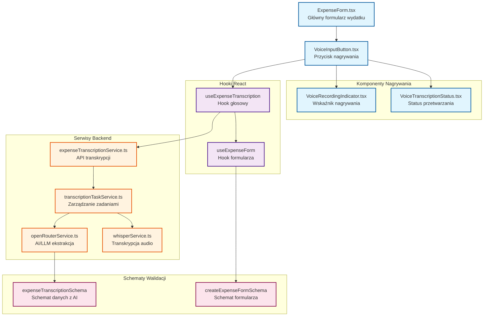
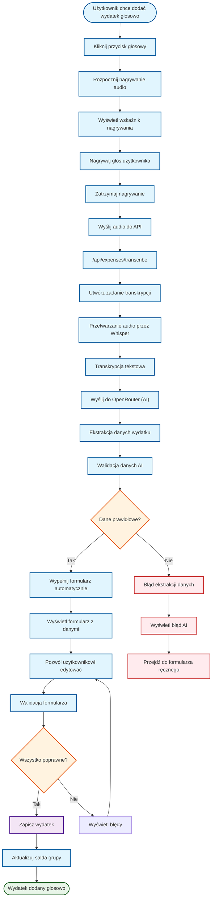
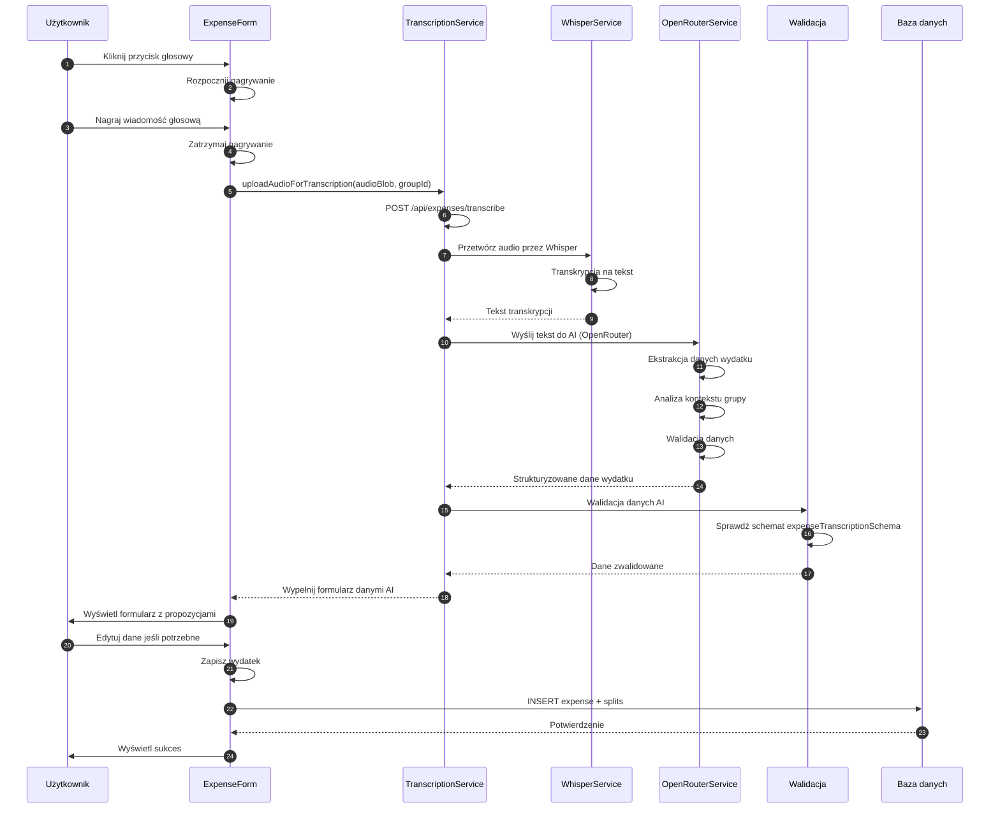
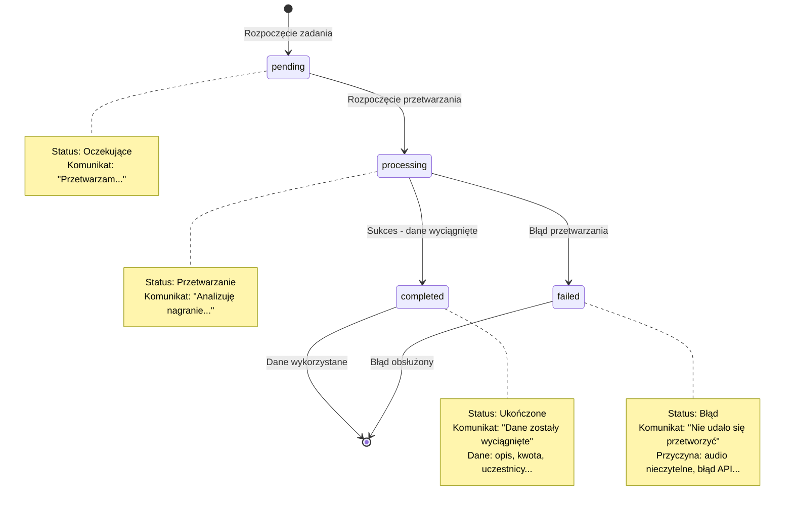

# Architektura Dodawania Wydatków Głosowo

## Diagram Komponentów UI

## Diagram Przepływu Dodawania Wydatku Głosowo

## Szczegółowy Diagram Przetwarzania AI

## Diagram Stanów Zadania Transkrypcji

